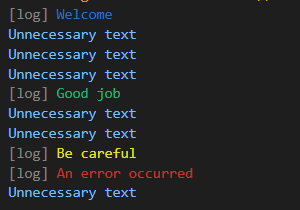

Change the color of the prints to separate really important information

## Features



## Usage

```dart
import 'package:color_print/color_print.dart';

logInfo("Welcome");// Blue print
logSuccess("Good job");// Green print
logWarning("Be careful");// Yellow print
logError("An error occurred");// Red print

```

## Additional information

Please suggest an idea to improve the package
